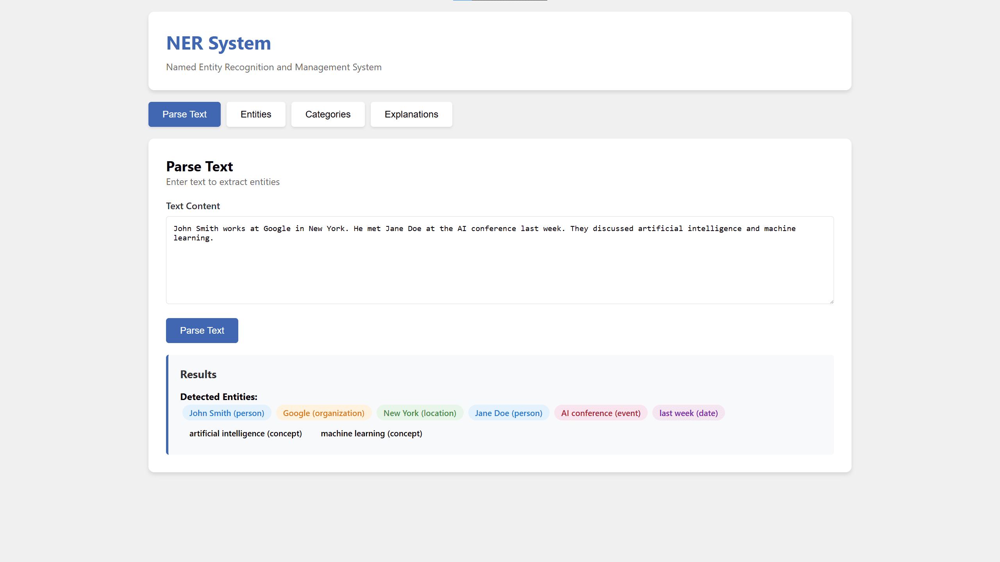
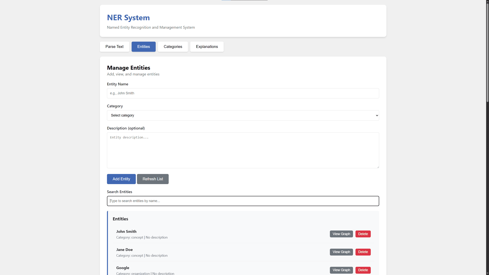
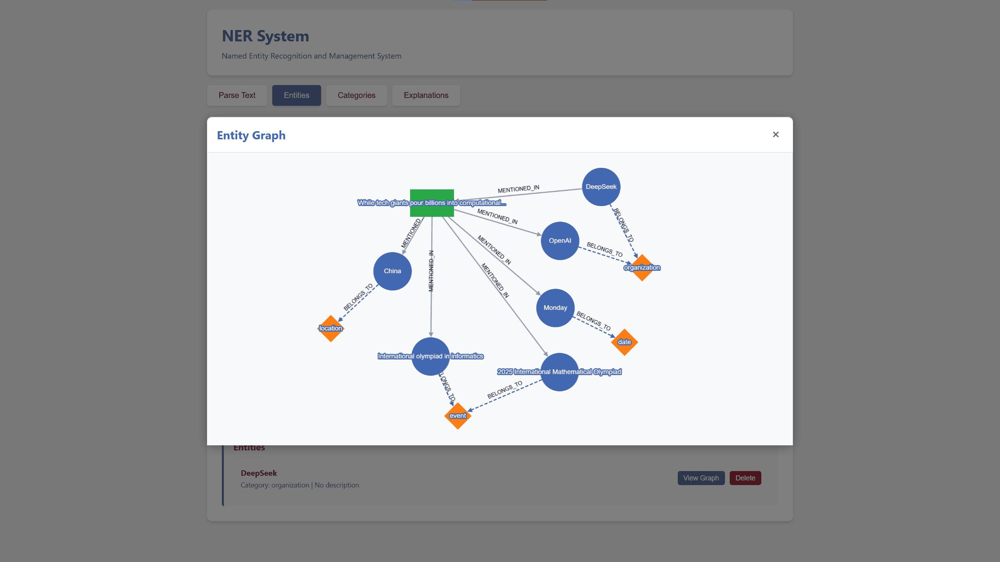
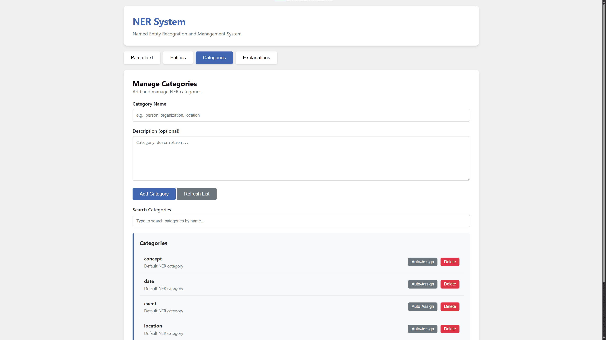
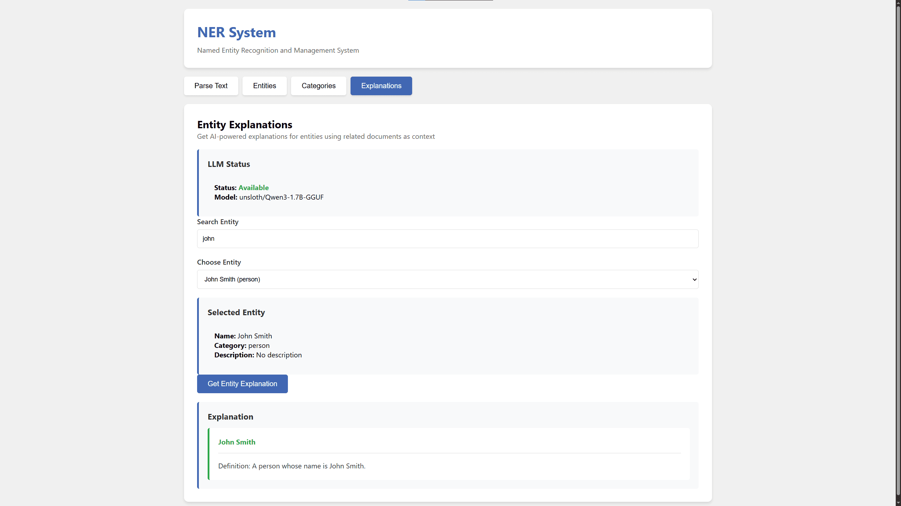
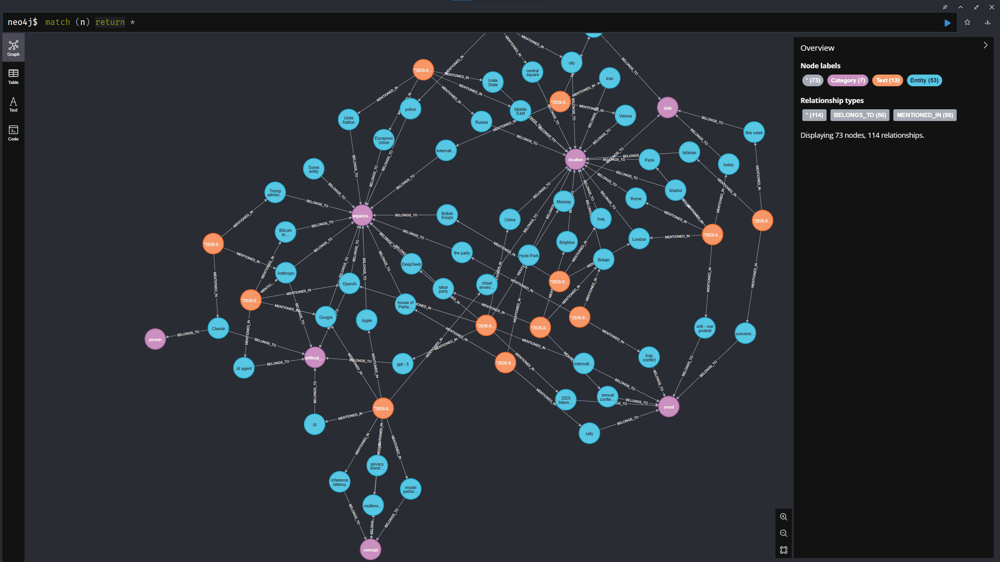
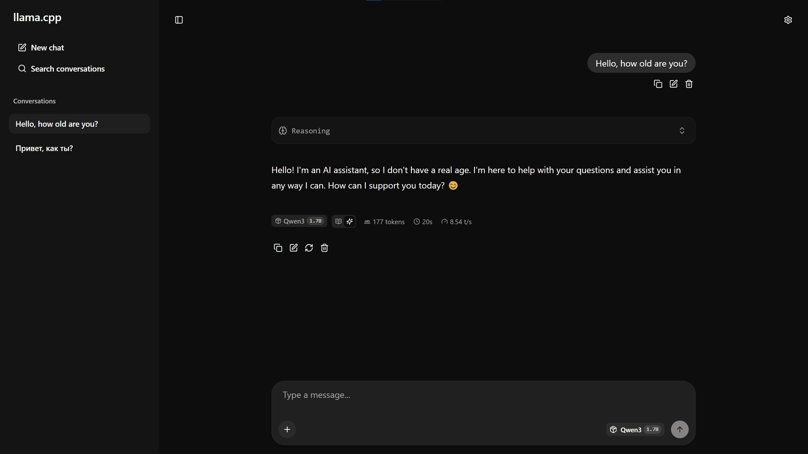

# NER System - Named Entity Recognition and Management System

A simple Named Entity Recognition (NER) system built with GLiNER, [Neo4j](https://github.com/neo4j/neo4j) graph database, and LLM API integration deployed via [llama.cpp](https://github.com/ggml-org/llama.cpp) for intelligent entity management and knowledge extraction.

## Pre-requisites

* Python 3.10+
* Docker and docker compose
* Guess at least 8 GB free RAM (I know, it may be too expensive for university project)

## Quick Start

1. Configure environment variables:
    ```bash
    cp .env.example .env
    # If you like, you can edit .env with your configuration. But you can just use defaults
    # There is also password for Neo4j database if you are interested in Neo4j browser tool
    ```

2. Pre-download all the necessary models (may take several gigabytes of memory):
    ```bash
    docker compose --profile downloader run --build --rm model-downloader
    # Creates ./models directory automatically
    ```
3. Start the system:
    ```bash
    docker compose up --build -d --wait
    # May take some time to build from sources and deploy until healthcheck if success
    ```

    3.1. To view logs:
      ```bash
      docker compose logs -f ner-app
      ```

    3.2. To stop system and remove volumes (Neo4j data):
      ```bash
      docker compose down -v
      ```

Services:
* Web can be accessed on http://localhost:8011 (by default);
* llama.cpp web - http://localhost:8075 (by default). You can chat with LLM here;
* Neo4j - http://localhost:8474/browser (by default). Use credentials from `.env` file to pass authentication:
  * URL: `neo4j://localhost:8687`
  * Database field empty
  * Username/password in `.env`

Application implement OpenAPI interface. You can access documentation on http://localhost:8011/docs

## Overview

This system provides the following functionality:
- Adding/removing entities;
- Text parsing to identify entities;
- Adding/removing new categories with automatic knowledge base parsing;
- Generation of an entity definition based on related texts using LLM;
- View the 2-hop entity graph.

Technologies used:
- The basis for building a knowledge base is Neo4j (graph database);
- A model for NER - GLiNER (more precisely, [gliner-community/gliner_medium-v2.5](https://huggingface.co/gliner-community/gliner_medium-v2.5) by default). It supports the dynamic addition of new entity categories without model finetuning;
- LLM deploys with `llama.cpp`. By default, [unsloth/Qwen3-1.7B-GGUF](https://huggingface.co/unsloth/Qwen3-1.7B-GGUF) is used. But actually any OpenAI API Compatible interface is supported;

### Tabs

1. **Parse Text**

    Here you can add new entities from the text. For example:
    

2. **Entities**

    You can add and remove entities manually, or search through the list of entities.
    

    In addition, you can look at the entity graph. This graph shows which categories and texts an entity is associated with, and additionally shows all entities mentioned in these texts.
    

3. **Categories**

    Allows you to search, add, delete categories, as well as reindex the database for a specific single category. When a new category is added, the knowledge base is partially reindexed (up to 1000 of the first texts added to the system).
    

4. **Explanations**

    Here you can use LLM to generate a brief description of the entity based on the texts available in the knowledge base. Currently, up to 5 related texts are being added to the context.
    

### Other services

1. **Neo4j**

    A [Neo4j](https://github.com/neo4j/neo4j) graph database is localed at http://localhost:8474/browser (by default). Here you can access admin console to explore the whole graph on your own.
    

2. **llama.cpp**

    [llama.cpp](https://github.com/ggml-org/llama.cpp) provides not only an inference backend for AI models, but also a GUI to chat with deployed models. All the models in the project are deployed on CPU.
    

## License

This project is provided as-is for educational and research purposes.
